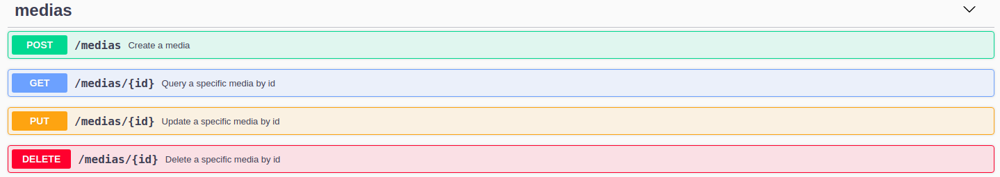

# Media Saver API

Media Saver is an application that allows you to save as much as information you want about medias, permitting you to create, update, list and delete all of them.
____

# Dependencies

- NodeJs - v12.16.1 or later
___

# Getting Started

- Clone Project
- Install dependencies
- Start the API server by running: `npm start`
- Server runs on **3000**
- Documentation runs on **3000/documentation**
- Run tests by: `npm test`

**Obs: You are also able to create, update, list and delete data through the documentation.**
___

# EndPoints

___
